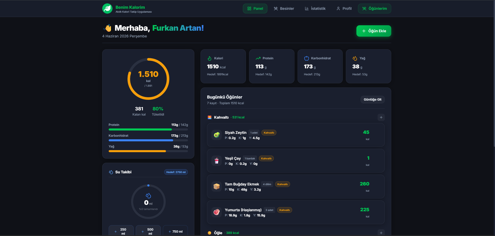
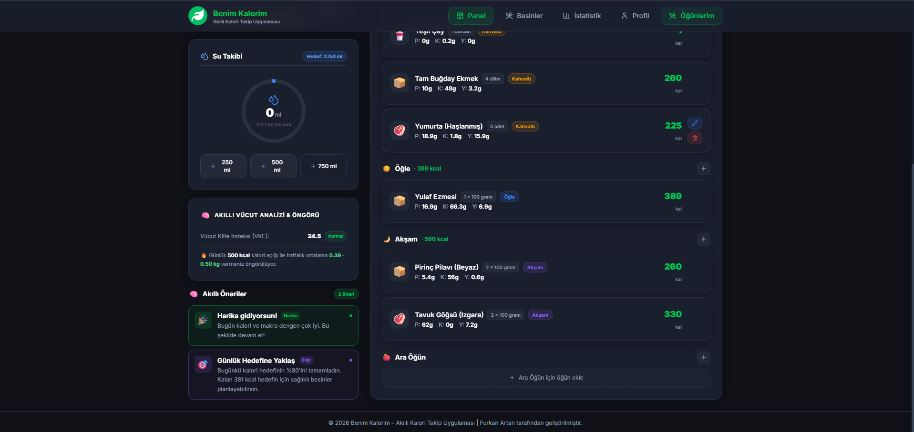
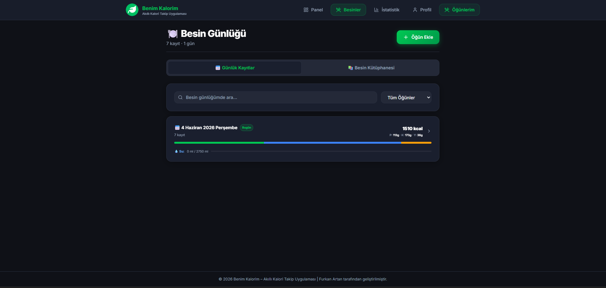
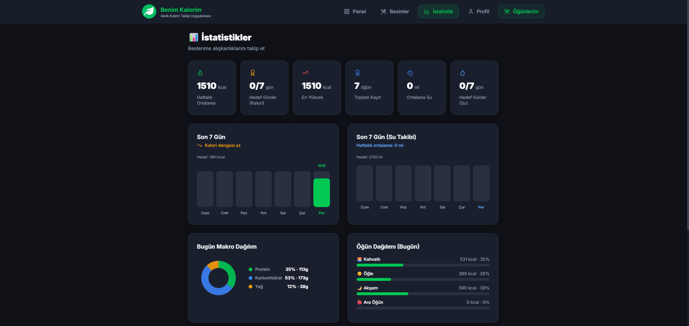
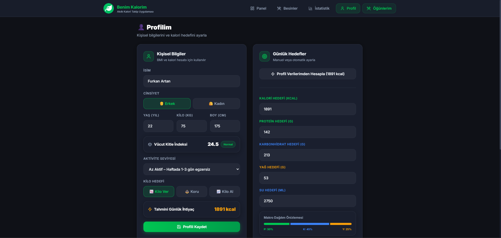
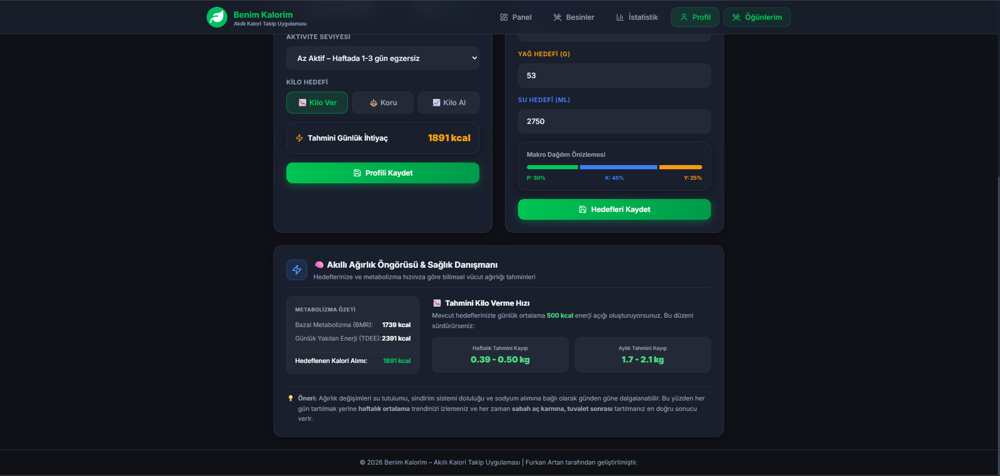
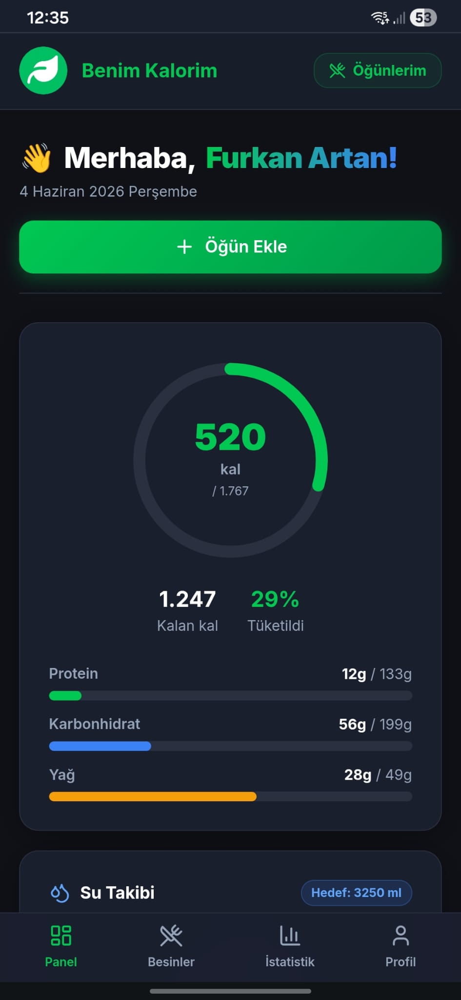
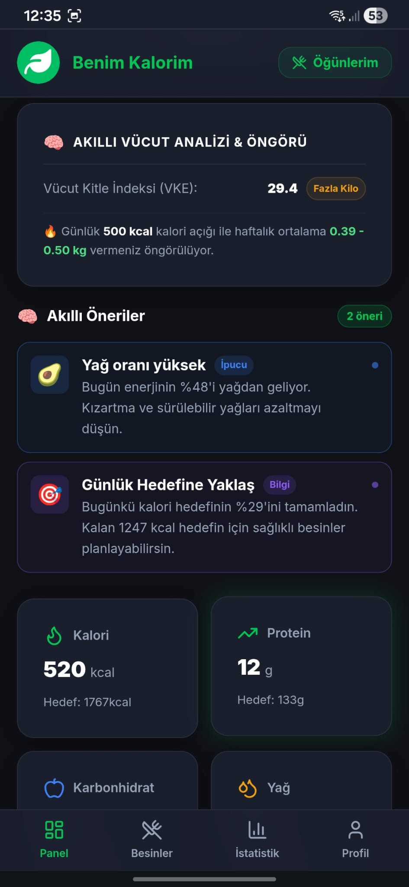
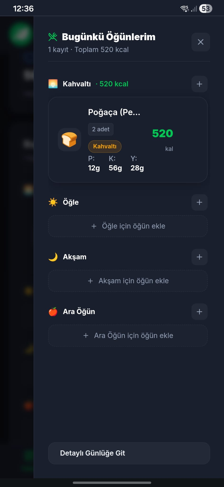

# Benim Kalorim – Akıllı Beslenme ve Su Takip Asistanı 🍏💧

**Benim Kalorim**, kullanıcıların günlük kalori, makro besin (karbonhidrat, protein, yağ) ve su tüketimlerini zahmetsizce takip etmeleri için tasarlanmış modern, responsive ve kullanıcı dostu bir web uygulamasıdır. 

Uygulama, backend sunucusu gerektirmeksizin tamamen tarayıcı üzerinde (kural tabanlı) çalışan **Akıllı Öneri Sistemi** sayesinde günlük beslenme alışkanlıklarınıza göre size özel tavsiyeler ve uyarılar sunar.

---

## 🌟 Öne Çıkan Özellikler

* 🎯 **Kişiselleştirilmiş Onboarding:** Yaş, kilo, boy ve günlük hedeflere göre kişisel profil kurulumu.
* 📊 **Dinamik Dashboard:** Kalori halkası, makro çubukları ve su takip modülü ile günün özetini anlık görün.
* 🧠 **Akıllı Öneriler (Smart Suggestions):** 
  - Öğün atlama uyarıları (örn: Kahvaltı/Öğle yemeği atlandığında uyarır).
  - Makro dengesizlik analizleri (örn: Yüksek karbonhidrat veya düşük protein alımı tespiti).
  - Su tüketimi hatırlatıcıları.
  - Gün sonu/gece atıştırmalığı tavsiyeleri.
* 💧 **Gelişmiş Su Takibi:** Günlük su tüketim hedefinizi animasyonlu ve pratik modülle takip edin.
* 🍎 **Besin Kütüphanesi:** Sık tüketilen besinleri hızlıca arayıp öğünlerinize ekleyin.
* 📈 **İstatistikler ve Grafikler:** Geçmiş günlerin kalori ve makro dağılımını görsel grafiklerle inceleyin.
* 🔒 **Gizlilik Odaklı:** Tüm veriler yerel olarak tarayıcınızda (LocalStorage) saklanır, verileriniz üçüncü şahıslarla paylaşılmaz.

---

## 📸 Ekran Görüntüleri (Screenshots)

### 🖥️ Masaüstü Görünümü

| Ana Panel (Giriş Yapılmamış / Yeni Gün) | Ana Panel (Günlük Kayıtlar Girilmiş) |
| :---: | :---: |
|  |  |

| Besin Arama & Ekleme | Gelişmiş İstatistik Grafikleri |
| :---: | :---: |
|  |  |

| Profil & VKI Hesaplama | Günlük Hedef Güncelleme |
| :---: | :---: |
|  |  |

### 📱 Mobil Görünüm

<p align="center">
   &nbsp;
   &nbsp;
  
</p>

---

## 📲 PWA (Aşamalı Web Uygulaması) Kurulumu

Bu proje **PWA (Progressive Web App)** desteğine sahiptir. Bu sayede uygulamayı tarayıcı üzerinden açıp cihazınıza (mobil veya masaüstü) tıpkı bir mağaza uygulaması (native app) gibi kurabilirsiniz.

### 📱 Mobil Cihazlara Kurulum (iOS & Android)
* **Android (Google Chrome):**
  1. Canlıdaki site adresine gidin.
  2. Tarayıcının sağ üstündeki **üç noktaya** tıklayın.
  3. **"Ana Ekrana Ekle"** veya **"Uygulamayı Yükle"** seçeneğini seçin.
* **iOS / iPhone (Apple Safari):**
  1. Canlıdaki site adresine Safari tarayıcı ile gidin.
  2. Alt kısımdaki **"Paylaş"** (yukarı ok) butonuna basın.
  3. Açılan menüden **"Ana Ekrana Ekle"** (Add to Home Screen) seçeneğini seçin.

### 💻 Masaüstü Bilgisayara Kurulum (Windows / macOS)
* **Google Chrome / MS Edge / Brave:**
  1. Sitenin adres satırının en sağında çıkan **"Yükle"** (monitör üzerinde indirme oku) simgesine tıklayın.
  2. Veya tarayıcı menüsünden **"Benim Kalorim uygulamasını yükle"** seçeneğini seçin.

> [!TIP]
> Kurulum tamamlandığında uygulama telefonunuza veya bilgisayarınıza kendi logosuyla eklenecektir. Bu sayede uygulamayı tam ekran (tarayıcı çubuğu olmadan) kullanabilir ve internet bağlantısı olmasa dahi (offline) hızlıca açabilirsiniz.

---

## 🛠️ Teknolojiler

* **Framework:** React 19 + TypeScript
* **Derleyici:** Vite
* **Styling:** Tailwind CSS + SASS/SCSS
* **İkonlar:** Lucide React
* **Yönlendirme (Routing):** React Router DOM

---

## 🚀 Yerel Kurulum

Projeyi kendi bilgisayarınızda çalıştırmak için aşağıdaki adımları takip edebilirsiniz:

1. Proje dosyalarını indirin veya klonlayın.
2. Bağımlılıkları yükleyin:
   ```bash
   npm install
   ```
3. Geliştirme sunucusunu başlatın:
   ```bash
   npm run dev
   ```
4. Tarayıcınızda `http://localhost:5173` adresine gidin.
